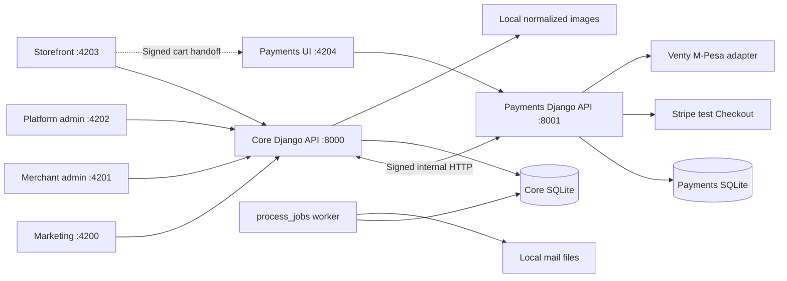

# Current architecture

Code snapshot reviewed on 2026-09-09. This describes the implemented local alpha; the [implementation prompt](../CODEX_IMPLEMENTATION_PROMPT.md) also contains future requirements. See [foundation decisions](FOUNDATION.md) and [implementation status](../IMPLEMENTATION_STATUS.md).

## System shape

MSHOPPA contains five Angular browser applications, a modular Django core, a separate Django payment process, and one database-backed background worker. Core owns commerce and merchant identity. Payments owns provider configuration and payment sessions. Each service has its own SQLite database, but payments imports core settings and protocol code and uses core's Python environment. It is a process/data boundary, not an independently packaged deployment.



No PostgreSQL, Redis, Docker, reverse proxy, or standalone storage process is required for development. Celery configuration exists, but `dev:all` runs the database worker rather than a Celery worker. Frontend builds produce browser assets; no SSR server or production deployment configuration is implemented.

## Source and runtime map

| Location | Responsibility | Local runtime |
| --- | --- | --- |
| `apps/marketing` | Landing, signup, login | `localhost:4200` |
| `apps/merchant-admin` | Overview, applications, catalog, operations, settings | `admin.localhost:4201` |
| `apps/platform-admin` | MFA-protected application review and wallet operations | `platform.localhost:4202` |
| `apps/storefront` | Host-resolved shop, product detail, cart, tracking, preview | `<slug>.localhost:4203` |
| `apps/payments` | Shared customer-details form and payment UI | `payments.localhost:4204`; generated checkout links use `localhost:4204` |
| `services/core` | Accounts, businesses, catalog, checkout, orders, settlement ledger | `127.0.0.1:8000` |
| `services/payments` | Adapters, encrypted credentials, sessions, verified callbacks | `127.0.0.1:8001` |
| `services/storage` | Reserved future boundary | No implementation |
| `packages/ui` | Shared pages, session guard, shell, rich text, icons, styles | Imported into app builds |
| `packages/api-client` | Angular HTTP transport and generated OpenAPI types | Imported into app builds |
| `assets` | Brand assets, self-hosted Poppins fonts, design references | Copied by Angular builds |
| `scripts` | Development supervisor, five-app build, HTTP smoke checks | Node commands |

The toolchain declares Angular 21.2, TypeScript 5.9, Tailwind 4, Spartan brain 1.4.1, Node 24, Django 5.2, and Python 3.13. `package-lock.json` and `services/core/uv.lock` pin resolved dependencies. Payments' `pyproject.toml` supplies lint configuration, not a separate dependency set.

App entry points are `apps/*/src/main.ts`. Merchant/platform routes lazy-load shared feature pages. The shared API transport uses relative `/api/` URLs and fetches a fresh CSRF token before mutations. Angular development proxies preserve Host; the payments app has its own proxy targeting port 8001. Frontend session guards control navigation; backend permissions enforce access.

## Data ownership

| Owner | Records | Relationships and invariants |
| --- | --- | --- |
| Core `accounts` | `User`, `EmailChallenge`, `OutgoingEmail` | Identity, verification challenges, durable mail state |
| Core `businesses` | `BusinessApplication`, `Business`, `Membership`, `Domain`, `StoreSettings`, `AuditEvent` | One membership per user/business; unique domain; approved application linked to one business |
| Core `catalog` | `Product`, `Variant`, `ProductImage` | Product belongs to business; variants/images belong to product; removed variants retained inactive |
| Core `checkout` | `Order`, `OrderLine`, `PaymentEvent` | Per-business checkout idempotency; snapshot names/prices; event IDs deduplicate callbacks |
| Core wallet | `WalletSettlement`, `Withdrawal` | At most one settlement per order; per-business withdrawal request key; positive amounts |
| Payments `simulator` | `PaymentConfiguration`, `PaymentSession` | Versioned encrypted configuration; one session per core order; opaque access token |

The payment app retains the historical name `simulator`, but contains Stripe/Venty adapters and optional simulations. Its business/order UUIDs reference core logically, without cross-database foreign keys. Signed HTTP, idempotency, and callback validation coordinate services without a distributed transaction.

Core uses `.local/mshoppa.sqlite3`; payments uses `.local/payments.sqlite3`. SQLite writes use `IMMEDIATE` transactions with a 20-second timeout. Images live under `.local/media/`, development emails under `.local/mail/`, and generated secrets under `.local/`. Databases, uploads, credentials, generated output, and local agent logs are excluded from Git.

Customer management groups guest orders by normalized email; there is no shopper identity database. Promotions edit variant offer prices, without a coupon/campaign engine. Stock is updated directly on variants; a full inventory movement ledger is not implemented.

## Identity, tenancy, and content access

Django sessions and CSRF protect account operations. Session cookies are host-only, HTTP-only, and SameSite Lax, with secure cookies outside debug. Staff require TOTP MFA for platform actions. Merchant membership does not grant platform privileges; platform privileges do not imply merchant membership.

Application queries enforce tenant isolation using business foreign keys and membership checks. There are no tenant schemas or database row-security policies. Public shops resolve through exact verified `Domain` records and require ready provisioning, an online business, and no suspension. Query parameters cannot select an arbitrary public business.

| Capability | Merchant roles |
| --- | --- |
| Read catalog, settings, orders, customers, domains, promotions | Owner, manager, fulfillment, support |
| Change catalog, branding/settings, local domains, offers | Owner, manager |
| Update fulfillment, tracking, order notes | Owner, manager, fulfillment |
| Read payment transactions and safe provider configuration | Owner, manager |
| Change provider configuration, manage staff, view wallet/request withdrawals | Owner |

Staff additions require an existing verified merchant account. Owner protections prevent removing the last active owner or changing one's own access. Fulfillment advances only for paid orders and cannot move backwards. Platform wallet/application decisions require platform permission with MFA.

Private previews use five-minute signed grants bound to business, issuing member, and exact hostname, with membership rechecked on access. The browser receives a fragment token, clears it, and uses a request header. API responses receive `Cache-Control: private, no-store`.

JPEG/PNG/WebP uploads are decoded, bounded, stripped of metadata, and normalized to WebP. Product image reads require image-specific expiring grants; logo/cover reads use corresponding signed content endpoints. Merchant rich text is sanitized in `apps/rich_text.py`. Core serves authorized files, not an unrestricted media directory.

## Main workflows

### Application approval and provisioning

1. A merchant registers, verifies email through the durable outbox workflow, and submits an application.
2. An MFA-authenticated reviewer approves, requests changes, or rejects it. Approval records business/provisioning intent and audit information transactionally.
3. `manage.py process_jobs` provisions settings, owner membership, and the verified local domain. Initial provisioning puts the shop online; retries preserve an existing owner's online/offline choice.
4. The worker also expires unpaid reservations and sends bounded batches of emails outside write transactions, with up to five attempts and at-least-once delivery. Run one worker for this SQLite phase.

Application states: `draft → pending → approved / changes_requested / rejected`; changes-requested applications can be resubmitted. Provisioning: `queued → ready / failed`, with reviewer retries for failures.

### Catalog and storefront

Owners/managers edit products, named variants, stock/prices/offers, and galleries. Drafts stay private. Search, category/sort filters, product detail, and featured content remain business-scoped. Settings own cover/logo, profile, contacts, policies, tax rate, provider toggles, and theme. Local domain management accepts supported `.localhost` aliases; it does not verify public DNS or issue TLS certificates.

The cart persists variants/quantities in store-scoped browser local storage. Core recalculates availability, prices, taxes, enabled payment methods, and totals. Browser values do not determine the payable amount.

### Checkout and payment

1. The storefront posts items to `/api/checkout/handoff/`. Core returns a signed one-hour handoff with domain, business, items, and checkout key. It contains no customer details and creates no reservation yet.
2. Payments UI exchanges the handoff through its `/api/checkout/`. Payments calls core `/api/payments/checkout/` using an internal signature to obtain a quote or submit details.
3. Core verifies the ten-minute signed quote, recalculates totals, rejects changed prices/taxes, and creates an idempotent order with snapshot lines. It atomically decrements available stock for a 35-minute reservation.
4. Core creates a payment session outside the database transaction. One session per order supports retries. An unavailable payment service leaves the reservation/key available for retry.
5. Payments selects the configured backend and snapshots encrypted effective credentials. Stripe opens hosted test Checkout; Venty initiates M-Pesa; explicit simulator sessions expose local simulation controls.
6. A verified provider callback or server-side status refresh sends an HMAC-signed event to core. Core checks order, session, provider, amount, currency, and event identity. Browser return redirects are not payment proof.
7. Core completes or releases the reservation. Duplicate events do not deduct stock twice. Late success after release sets `payment_review_required` without reclaiming inventory. Tracking uses an opaque token scoped to the original shop.

Direct core `/api/cart/quote/` and `/api/checkout/` routes also remain implemented. The current cart UI uses the shared payments-page handoff.

Internal HTTP uses HMAC-SHA256 over timestamp/body with a five-minute window. The core callback retains `/api/payments/webhooks/dummy/` for internal verified results, separately from Stripe signatures and Venty's callback secret. Undelivered results and uncertain provider initiation require manual reconciliation; there is no autonomous durable payment retry worker.

### Provider configuration and settlement

Stores default to shared MSHOPPA payment accounts with optional owner-managed overrides. Configuration versions and per-session effective credentials are encrypted with `MSHOPPA_ENCRYPTION_KEY`. Sessions retain their backend/account. Merchant responses expose safe flags/readiness, not shared credentials. Missing configuration does not cause simulated success.

Stripe accepts test keys only. Venty can collect real M-Pesa funds when configured; local debug mode does not make that provider a sandbox. Ambiguous Venty initiation is marked unknown and blocked from automatic repeat initiation. Tests mock provider calls. See [payments documentation](../../services/payments/README.md) for configuration and callback details.

The wallet is a core-owned manual settlement ledger. Paid Venty orders qualify for settlement review; Stripe test/simulator totals are excluded. An MFA-authenticated operator records net funds actually received with a reference. Settled amounts become available; pending withdrawals reserve funds; cancellation/rejection releases them; completion consumes them. Operators execute transfers separately and record results. No automatic payout or provider balance lookup is implemented.

## API contracts and operational boundaries

Routes are registered in [core URLs](../../services/core/config/urls.py) and [payment URLs](../../services/payments/payment_config/urls.py). Core publishes `/api/schema/` through drf-spectacular. [openapi.yaml](openapi.yaml) and generated TypeScript are checked-in artifacts. Later operations also use local frontend interfaces and generic object responses, so these are not fully typed contracts for both services.

Follow the [README quick start](../../README.md#quick-start). `npm run dev:all` launches both APIs, one worker, and five Angular servers and stops the group together. It reads `services/payments/.env` for the payment API only; shell environment wins. Core and standalone Django commands require exported overrides. Django itself does not load dotenv files. Payments requires `DJANGO_DEBUG=1` and `LOCAL_DUMMY_PAYMENTS=1`, including with provider adapters. Internal payment URLs are loopback constants.

Both services expose `/api/health/`. Core probes its database; payments returns service/mode metadata rather than checking dependencies. Logs go to process output; business decisions, merchant mutations, and wallet actions also record audit rows. Backup/recovery automation, centralized observability, CI, and production deployment are not implemented.

Production work remains: database/concurrency decisions, independently deployable services and identities, HTTPS/domain routing, external mail, shared throttling, reconciliation/refunds, backup/restore validation, account recovery/invitations, shipping/tax rules, inventory movements, SSR/cache strategy, and browser/accessibility verification. Publishing GitHub source does not deploy applications or migrate local runtime data.

## Verification entry points

```sh
npm run check
npm run build
cd services/core
.venv/bin/python -m pytest -q
.venv/bin/python manage.py check
.venv/bin/python manage.py makemigrations --check --dry-run
cd ../payments
../core/.venv/bin/python manage.py test simulator
../core/.venv/bin/python manage.py makemigrations --check --dry-run
```

Core tests cover identity/MFA, tenancy, roles, catalog/content, checkout, wallet, and stock/payment invariants. Payment tests cover configuration isolation, signatures, CSRF, provider validation, replay, and ambiguous initiation using mocked provider calls. HTTP smoke and Playwright suites require running services. Results are in [implementation status](../IMPLEMENTATION_STATUS.md).
